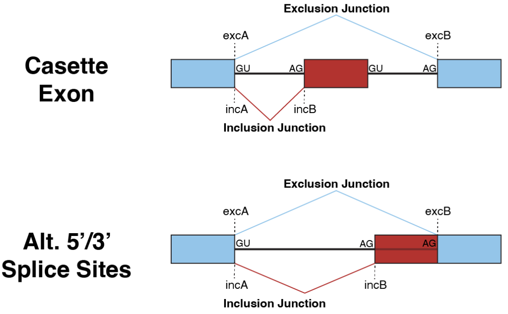

# SSEC-JHU SnapMine

# About 
Web application for junction or gene expression count extraction and analysis:
* Preprint at: [Large-scale RNA-seq mining reveals ciclopirox triggers TDP-43 cryptic exons](https://www.biorxiv.org/content/10.1101/2024.03.27.587011v1)
* **SnapMine** is deployed at: https://snapmine.idies.jhu.edu/

## Build:
#### Initial Setup:
  * You will need to download the metadata files for the dataset of interest (or all) in a folder, renaming each file with the dataset name as prefix:
    * [srav3h](https://snaptron.cs.jhu.edu/data/srav3h/samples.tsv) to `srav3h_samples.tsv`
    * [gtexv2](https://snaptron.cs.jhu.edu/data/gtexv2/samples.tsv) to `gtexv2_samples.tsv`
    * [tcgav2](https://snaptron.cs.jhu.edu/data/tcgav2/samples.tsv) to `tcgav2_samples.tsv`
    * [srav1m](https://snaptron.cs.jhu.edu/data/srav1m/samples.tsv) to `srav1m_samples.tsv`
  * Change the `meta_data_directory` in [paths.py](https://github.com/ssec-jhu/snaptron-query/blob/main/snaptron_query/app/paths.py) to the directory of the metadata files downloaded 
  
#### with Docker:
  * Download & install Docker - see [Docker install docs](https://docs.docker.com/get-docker/).
  * ``cd`` into repo dir.
  * Build image: ``docker build -t <image_name> .``

## Run
  Follow above [Build](#Build) instructions if you have not done so already.
  #### with Docker:
  * Run container from image: ``docker run -d -p 8000:8000 <image_name>``. _NOTE: ``-p 8000:8000`` is specific to the example application using port 8000._
  * Alternatively, images can be pulled from ``ghcr.io/ssec-jhu/`` e.g., ``docker pull ghcr.io/ssec-jhu/snaptron-query:pr-1``.

  #### with Python ecosystem:
  * Run ``python3 -m  snaptron_query.app.main_dash_app``.This will have Dash running on http://127.0.0.1:8050/.
    
  #### with Tox:
  * Run ``tox -e test exec -- python -m snaptron_query.app.main_dash_app``.This will have Dash running on http://127.0.0.1:8050/.

## Using tox

* Run tox ``tox``. This will run all of linting, security, test, docs and package building within tox virtual environments.
* To run an individual step, use ``tox -e {step}`` for example:
  * ``tox -e format``
  * ``tox -e test`` 
  * ``tox -e build-docs``
  * ``tox -e format``

Typically, the CI tests run in github actions will use tox to run as above. See also [ci.yml](https://github.com/ssec-jhu/base-template/blob/main/.github/workflows/ci.yml).
